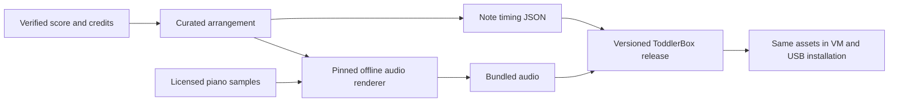

# Music: historical research and current implementation

Research date: 2026-10-02. Baseline: `3b2917941187627360371447447dcfd465ba4457`, branch `system/bootable-ubuntu`.

**Historical research, not current UI instructions.** Music now also supports playable piano keys over a song and Free Play; the current contract and asset guide define shipped behavior. This document preserves the research proposal that the user approved. Implementation ships six 21–33-second PCM piano tracks, an embedded activity, and an audio-enabled VM fixture. See [the current contract](toddlerbox_design_contract.md), [asset sources and generation recipe](assets/music/README.md), and [validation results](VALIDATION.md) for current behavior and evidence. The proposal's source-selection and qualification notes below describe what was known at the research checkpoint.

Implementation uses a locked Python/NumPy sample renderer with seven pinned CC0 piano excerpts instead of an SFZ engine. Mary uses a checked familiar melody from a pinned MIT-licensed MIDI fixture, with notices retained. Audio/cues regenerate identically offline. Source licenses and musical verification limits are recorded in [CREDITS.md](assets/music/CREDITS.md); human listening and HP latency/volume remain qualification steps.

## Recommendation

Add Music as a fourth embedded pygame activity. Start with six familiar, short instrumental arrangements, a fixed piano keyboard, and falling notes that show exactly what is sounding. Give the child song choices, a large Play/Pause control, an autoplay toggle, and Home. Keep the piano a display: touching it does not play notes, grade performance, or interrupt playback.

Use one curated musical score to generate both the audio and the animation cues. Prepare the audio during development/building, then bundle it with the existing versioned release. The installed system remains offline and uses the same assets in the VM and on the HP.

This fits the current architecture. The main work is arranging and listening to the music, making sound and animation agree, and handling audio failures and activity transitions. It does not require replacing pygame or the boot/session design.

## Research findings and reusable sources

No existing music proposal or implementation was found in the current checkout, no matching music history was found in the searched local Git history, and the GitHub issue query returned no issues. That does not establish whether research exists outside this repository.

The underlying composition, a particular arrangement/edition, a recording, and instrument samples have separate provenance. A public-domain composition alone does not establish permission to redistribute a modern performance or arrangement. Record these separately for each bundled piece.

| Source | Verified in this pass | Recommended use |
| --- | --- | --- |
| [Mutopia Project](https://www.mutopiaproject.org/legal.html) | Offers downloadable scores, LilyPond sources and MIDI. Individual editions use public-domain dedications or particular Creative Commons licenses; the whole catalog has no single blanket public-domain status. Three relevant editions are identified below. | Primary source for classical melodies and editable scores. Simplify and transpose selected phrases; do not import complete concert arrangements unchanged. |
| [Wikimedia Commons: Frère Jacques](https://commons.wikimedia.org/wiki/File:Fr%C3%A8re_Jacques.svg) and [Row Your Boat](https://commons.wikimedia.org/wiki/File:Row_your_boat.svg) | Both file records identify Mysid's MuseScore-created notation as **CC0**. These are downloadable notation images, not verified synchronized audio/MIDI packages. | Transcribe the short melodies into our arrangement format, check against the notation, and retain source/author links. |
| [Chrome Music Lab](https://musiclab.chromeexperiments.com/About) | Its About page describes accessible musical experiments. The [official code repository](https://github.com/googlecreativelab/chrome-music-lab) reports Apache-2.0 licensing. | Inspiration for clear visual relationships between pitch, rhythm and sound. It is not a blanket license to reuse arbitrary recordings, and embedding its browser experiments is unnecessary for this activity. |
| [VSCO 2 Community Edition](https://github.com/sgossner/VSCO-2-CE) | Repository has a [CC0 license](https://github.com/sgossner/VSCO-2-CE/blob/440300901dfe9275fd84e0b7763af1f8443ae62e/LICENSE), identifies its recording contributors, and includes upright-piano samples. The SFZ branch includes `UprightPiano.sfz` and `VSUpright1.sfz`. | Preferred instrument candidate for an initial listening prototype. Render only the selected piano into bundled tracks; no need to ship an entire orchestral library. Sound quality has not been auditioned here. |
| [Musopen](https://musopen.org/) | Potential source of classical scores/recordings, but its FAQ/About requests returned HTTP 403 in this environment. No individual recording license was verified. | Secondary lead. A recording also needs accurate note timing to support this visualization, so it is less convenient than a score-driven render. |

VSCO's README requests credit to Versilian Studios/Sam Gossner and Ivy Audio/Simon Dalzell where applicable. Include the appropriate credit and license even though CC0 itself does not impose attribution. Pin the actual selected samples and SFZ mapping, not just a repository name. The inspected SFZ branch commit was `6dd651d55dde97fd4028699be9d4481f26917891`; the inspected master commit was `440300901dfe9275fd84e0b7763af1f8443ae62e`. Both inspected branches carry CC0. Preserve that license and verify the selected mapping's complete sample inventory when importing assets.

[GeneralUser GS](https://github.com/mrbumpy409/GeneralUser-GS) was also investigated. Its license permits music production and software bundling, but explicitly acknowledges uncertain origins for some legacy samples. VSCO is the better initial provenance candidate. No instrument library was imported or rendered in this pass.

## Starter repertoire

Aim for approximately 20–45 seconds per selection, allowing a longer complete phrase where musically appropriate. Play a main motif once or twice with a proper ending; do not cut an audio file mid-phrase. A clear melody and occasional soft bass notes, fifths or triads are sufficient. Avoid dense four-part textures and rounds in the first version: they obscure the melody the child is following.

| Selection | Proposed treatment | Source status |
| --- | --- | --- |
| Mary Had a Little Lamb | One or two simple verses, quiet root-note accompaniment. Excellent first track for repeated and neighboring pitches. | Familiar traditional melody is suitable, but a specific edition matching the familiar tune still needs verification. A historical 1831 setting was located; it was not checked for melodic equivalence, so it is not yet the chosen source. |
| Twinkle, Twinkle, Little Star | The complete familiar theme, with sparse chords. | [Mutopia 2236](https://www.mutopiaproject.org/cgibin/piece-info.cgi?id=2236), *Ah Vous Dirai-Je Maman*, edited by J. J. Olson, is explicitly public domain. It contains Mozart variations arranged for two guitars; select the theme and make a small piano arrangement. The traditional tune predates Mozart's variations. |
| Ode to Joy | The familiar opening melody, resolving naturally; optional repeat with light chords. | [Mutopia 528](https://www.mutopiaproject.org/cgibin/piece-info.cgi?id=528), maintained by Peter Chubb, explicitly public domain. [MIDI](https://www.mutopiaproject.org/ftp/BeethovenLv/ode/ode.mid) and [LilyPond source](https://www.mutopiaproject.org/ftp/BeethovenLv/ode/ode.ly) are available. The source is SATB, so extract the tune and arrange deliberately. |
| Frère Jacques / Are You Sleeping? | One melody voice; repeat once if desired. No overlapping round initially. | [Mysid's CC0 notation](https://commons.wikimedia.org/wiki/File:Fr%C3%A8re_Jacques.svg) verified through the file metadata. Needs transcription and musical checking. |
| Row, Row, Row Your Boat | One verse repeated, preserving its lilting rhythm. | [Mysid's CC0 notation](https://commons.wikimedia.org/wiki/File:Row_your_boat.svg) verified through the file metadata. Needs transcription and musical checking. |
| Minuet in G, BWV Anh. 114 | A complete opening section with simplified accompaniment; likely the longest starter. | [Mutopia 75](https://www.mutopiaproject.org/cgibin/piece-info.cgi?id=75). Its [source](https://github.com/MutopiaProject/MutopiaProject/blob/master/ftp/BachJS/BWVAnh114/anna-magdalena-04/anna-magdalena-04.ly) identifies Allen Garvin's contribution as public domain and notes attribution to Christian Petzold. Credit Petzold, rather than repeating the older Bach attribution. |

For the recognizable cartoon-classical slot, a short **William Tell overture gallop** or **Carmen** theme is a good later candidate. Choose the actual phrase, verify a reusable score edition, and check that a simplified treatment still sounds right. These are candidate melodies, not cleared bundled assets. Use our own instrumental rendering; cartoon soundtrack recordings and modern character artwork are outside this proposal.

The first technical prototype can use Ode to Joy, Twinkle and Frère Jacques: enough to test repeated notes, leaps, chords and different phrase lengths. Expand to the six-song collection after listening review and source verification. No audio has yet been auditioned, and all final transcriptions, tempos and accompaniments still need checking.

## Child experience and visual design

Suggested layout, consistent with the existing left-side activity controls:

```text
+-----------------------------------------------------------+
| Music / current song                              [ Home ] |
|-----------------------------------------------------------|
| [lamb picture] |             falling notes                 |
| [star picture] |       short bars = short notes             |
| [joy picture]  |       long bars = held notes               |
| [bell picture] |                                           |
| [boat picture] |          melody         quiet chords      |
| [dance picture]|-------------------------------------------|
| [Play / Pause] |   fixed piano; keys light as notes sound   |
| [Autoplay]     |   white and black keys in normal positions |
+-----------------------------------------------------------+
```

Song buttons use simple original pictograms plus short titles, so reading is helpful but not required. Keep all six choices visible at the supported landscape sizes. The keyboard and falling-note field share exactly the same horizontal geometry. Home remains in its usual place. Confirm both 1024×600 and 1366×768, including four launcher choices, before calling the layout finished.

Use a fixed **two-octave span, provisionally C3–C5 inclusive (25 keys)**. This is a design assumption about the requested modest range, not a newly imposed product requirement. Arrange and transpose pieces to fit, with lower accompaniment and upper melody. Do not fold isolated notes into different octaves just to fit the screen; that changes the contour. If a worthwhile piece needs more space, reconsider the arrangement or adopt a fixed three-octave keyboard after comparing legibility.

Bars descend toward their matching keys. The leading edge reaches the key at note-on; bar length represents duration; the key stays highlighted until note-off. Give the melody a strong outline/color and accompaniment a softer, consistent treatment. Use actual keyboard geometry for sharps/flats, rather than equal-width lanes that no longer line up with the black keys. Show two or three seconds of upcoming notes, with a short lead-in so the first note is visible before sounding. Natural piano decay may continue after a key releases.

This gives passive exposure to high/low pitch, long/short notes, repetition, simultaneous notes and rests. It is an intuitive visualization, not a claim of measured teaching effectiveness. No scrolling score, note-reading requirement, flashing rewards, grading, or tempo controls are needed in the first version.

Proposed playback behavior:

- Entering Music starts the first song at a parent-configured volume. Booting into the launcher itself stays quiet.
- Selecting another song replaces the current one; selecting the current song restarts it. One physical touch produces one action.
- Autoplay defaults on, advances through the fixed playlist, and wraps. Turning it off lets the current selection finish once. A small quiet gap separates songs.
- Pause freezes both sound and visual position. Resume continues together. A stopped/finished selection restarts when Play is pressed.
- Home, parent transition, termination and activity exceptions stop playback and clear pending track transitions. Returning later starts a fresh Music session. There is no child-created music document to autosave.
- Volume lives in parent configuration. Apply it before every track starts; do not offer a child volume slider. Choose the actual default after listening on the hardware, since a software percentage does not establish speaker loudness.

Autoplay default, precise keyboard span, timbre and final song order remain inexpensive choices to adjust during the first prototype.

## Implementation approach

### Content and build pipeline

Keep a small canonical arrangement format: piece ID, tempo, beat unit, meter, and note events containing MIDI pitch, start tick, duration ticks, voice and velocity. Integer ticks support triplets without rounding drift. Start with constant tempo per piece; if a piece needs expressive timing, both rendering and cues must consume the same timing map. Record any intro silence and audio tail explicitly.



Use `uv` for Python generation/validation tooling. A MIDI writer/parser such as `mido` can be a development dependency if useful. An SFZ-capable offline renderer is needed for the proposed VSCO mapping; FluidSynth alone does not read SFZ. Select and pin the renderer after a small Linux rendering/listening trial. Keep synthesis, score parsing and any downloads outside the installed application's event loop.

Generate audio and cues together. Validate pitch range, positive note durations, bounded piece length/polyphony, expected audio duration, and cue/audio alignment. Include the renderer version, settings, input hashes and output hashes. Commit the small canonical arrangements and approved playback assets so normal system builds do not depend on changing third-party websites. Retain a reproducible regeneration recipe and identifiable instrument inputs.

Start the sync prototype with PCM WAV to avoid codec-offset ambiguity; use Ogg Vorbis for the shipped short collection if measured decoding/synchronization is satisfactory. Six 40-second tracks at 128 kb/s total about 3.8 MB; stereo 44.1 kHz 16-bit PCM for the same duration is about 42 MB. These are size estimates, not measured assets. Either is small enough that reliability and sound quality can decide the format.

For each track, preserve composition attribution, exact source URL/revision, source license, arrangement changes, instrument/sample attribution and license, and asset hashes. Store credits/license texts with the release in a parent-readable location. Do not infer the assets' license from the repository's code license. Review whether attribution or share-alike terms apply before substituting sources.

### Runtime and synchronization

Add `src/toddlerbox/music/` as another embedded runner registered with the existing launcher and configuration. Keep the single window, normal event processing, frame heartbeat, and Home behavior. Package scores/cues/audio under `assets/music/` through the existing release recipe. Update the application contract and launcher documentation when implementation actually exists.

Use the existing SDL mixer through `pygame.mixer.music` for streamed playback. Maintain explicit playing/paused/finished/unavailable state and a current-track generation. Derive visual position from a single playback-position adapter; do not advance music time by counting rendered frames or sleeping between notes. Index only notes in the visible time window and draw from the current position, so a dropped frame catches up naturally.

The [pygame-ce music reference](https://pyga.me/docs/ref/music.html) exposes several details that need tests:

- `get_pos()` reports elapsed playback milliseconds, does not include a starting seek offset, and returns `-1` when unavailable. It is not a sample-accurate measure of sound emerging from the speaker. Track intro offsets and measured output latency explicitly, and verify pause/resume semantics with the pinned SDL build.
- `get_busy()` is false while paused; that must not accidentally advance autoplay.
- `stop()` can post an end event. SDL end events carry no track-generation ID, and clearing the queue does not remove events already fetched into the current event batch. Disable/clear the owned end event during replacement and cleanup, suppress remaining end events after a same-batch track change, and check playback state before advancing. Alternatively, use state-aware completion polling. Test selection when the old end event is already in the batch; an application generation counter alone cannot solve this.
- The documentation says loading new music resets volume. Set the configured level after loading and before playing every track.
- `fadeout()` blocks. Use immediate stop for Home/recovery; any cosmetic fade must progress without blocking input or the heartbeat.

Start with a measurable target of note/key onset within about 50 ms of audible onset, with no accumulating drift over repeated playback. This is a proposed acceptance target, not a current result. Adjust the latency model using recordings on the VM and HP; if the mixer position cannot meet it consistently, revisit the playback adapter before adding more UI.

Cleanup belongs in a reliable activity exit/finally path: stop playback, cancel autoplay/end events, unload the track, and release Music-owned buffers. Avoid shutting down the process-wide display or mixer unexpectedly. Music must not use the launcher's blocking generic subprocess fallback identified in the independent review.

### Failure behavior

An unavailable audio device leaves Music quiet and responsive, with Home and song controls usable and the visualization stopped. Log a parent diagnostic; show no OS dialog or error trace. A later deliberate Play/selection may attempt initialization again. Do not repeatedly initialize the device on every frame or continue displaying a performance that is not sounding.

If a bundled track cannot load, skip it at most once in an autoplay traversal; stop after the bounded set is exhausted. Manual reselection can retry. Track changes, pause, Home and shutdown must remain responsive during failure. A genuinely stuck audio call remains within the existing whole-application watchdog and independent parent recovery boundary.

## Validation in the bootable system

The current `system/vm.sh` command provides no emulated sound device. Previous boot/session validation therefore does **not** establish guest audio playback. Music implementation must extend the VM fixture with an emulated audio controller and a capture backend, such as QEMU's WAV backend, so tests can inspect guest output without depending on host speakers.

| Layer | Required evidence |
| --- | --- |
| Content/build | Every track has source/license records; pitches and lengths satisfy the agreed arrangement bounds; actual decoded audio is non-silent and unclipped; notes/cues match the rendered performance; a person listens for correct melodies, rhythm, balance and clean endings. |
| Application | Repeated notes, simultaneous chords, rests and black keys align correctly. Pause/resume, selection at track end, rapid selection, autoplay wrap and stale end events produce the defined result. Home/exception/TERM cleanup stops sound. Missing/corrupt tracks and unavailable mixer produce bounded quiet recovery. |
| Input/layout | Raw touch and touch-emulated mouse do not double-select. Second fingers do not steal a gesture. Four launcher choices and Music controls fit the supported sizes. Resolve the shared input defects before relying on these controls. |
| Ubuntu VM | Boot the shared image, select Music through the child UI, capture nonzero guest audio, and confirm captured silence after Home/parent transition. Compare note timing with captured output. Exercise crash/hang recovery while audio is active, missing audio hardware, and repeated song changes while watching memory and frame latency. |
| USB installation | Install the same built system to a disposable VM disk and repeat playback/cleanup checks. Verify release asset hashes and that no network or first-run package installation is needed. |
| HP qualification | Listen through the actual speakers/headphone route; check volume, audio latency, touch edges/multiple fingers, parent transition and parent sleep/resume. This is a bounded hardware pass after the VM loop, not a prerequisite for development. |

SDL dummy-audio tests can verify control logic, but cannot establish audible output or synchronization. QEMU capture proves a guest output path, but cannot establish the HP's physical output latency or loudness.

## Work packages and relation to the review

1. **Content prototype:** prepare three short arrangements from verified sources, select/audition the piano, and produce matching audio/cues/credits with a pinned generation recipe. This resolves the main musical-quality and source-format uncertainties.
2. **Embedded activity:** implement playback state, keyboard/falling notes, song selection, pause, autoplay and cleanup. Integrate the shared input corrections; evolve only the small lifecycle helpers needed to avoid repeating the existing bugs.
3. **System qualification and full collection:** enable VM audio capture, test output/failures/transitions, finish the six-song repertoire and documentation, then build/install/test through the existing image pipeline. Perform the HP listening/input pass afterward.

These are implementation stages, not a promised schedule. Content transcription/listening and audio-clock behavior are the largest remaining variables. The research establishes viable sources and an implementation path; it does not establish completed musical assets or working guest audio.

The independent review recommends retaining the architecture. Fix its reproduced Paint autosave starvation and shared touch defects before everyday use; bucket-fill corruption and missing tap marks are also small, concrete priorities. Those repairs can be developed independently of music arranging. Controller-failure, disk-full, power-cut and HP qualification gaps remain system work even if the Music prototype succeeds.
