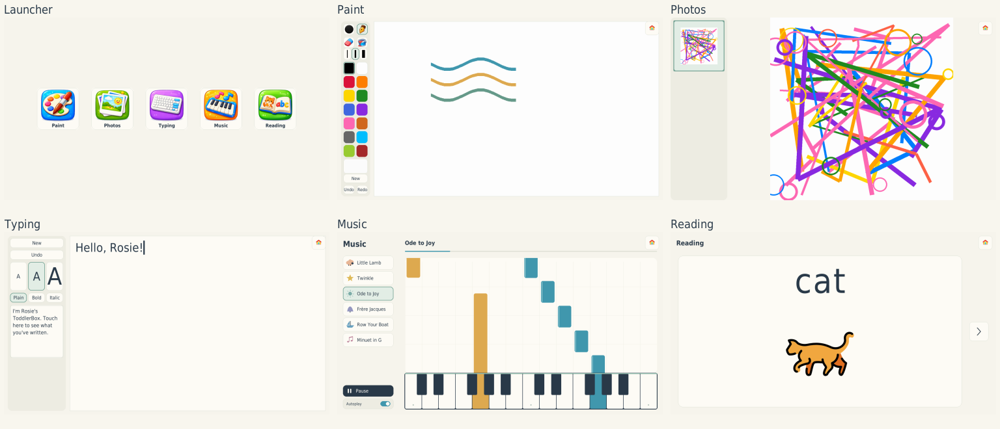
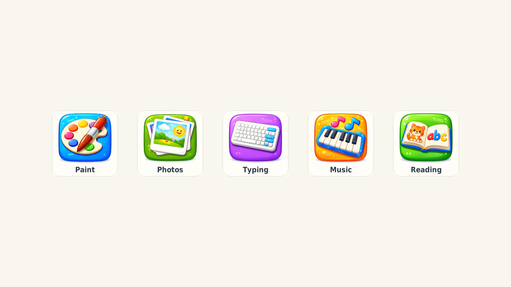
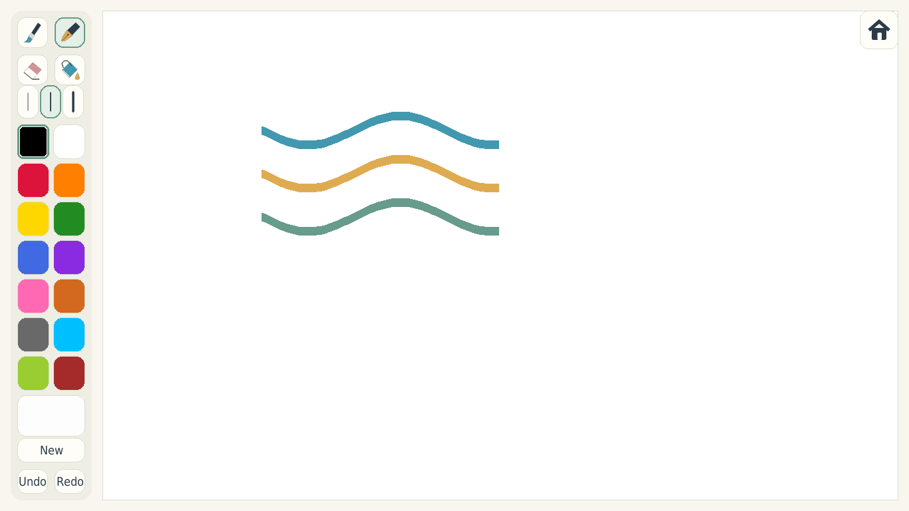
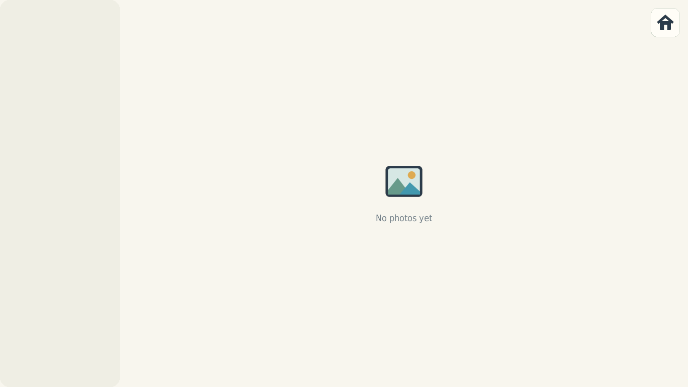
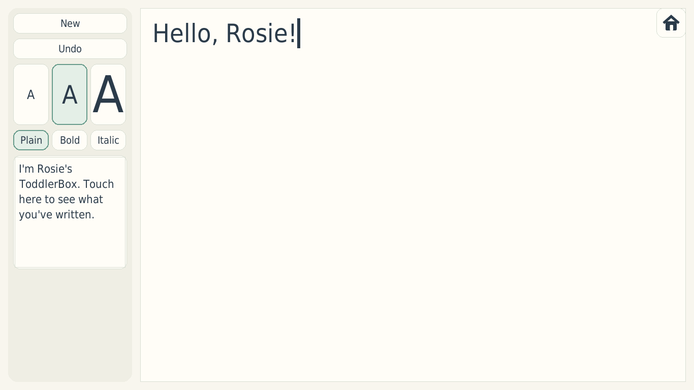
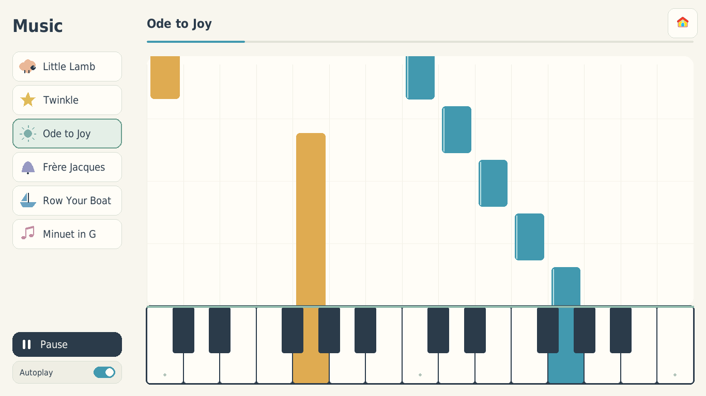
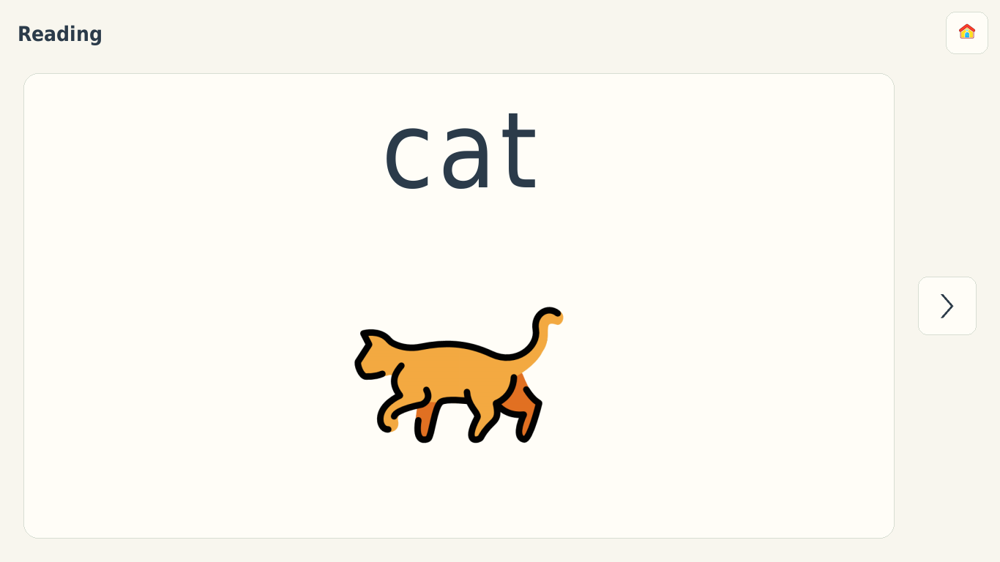

# ToddlerBox

**ToddlerBox** is a minimalist, offline-first Linux "kid mode" designed for very young children.
By default it boots into a fullscreen launcher with five large buttons:

- **Paint**
- **Photos**
- **Typing**
- **Music**
- **Reading**

All five activities share a cream-and-sage interface and the same Home button.
The original illustrated icons are preserved; Music and Reading have matching icons.
Shared pygame styling lives in `src/toddlerbox/ui/theme.py`.



There is no desktop environment visible, no file browser, no login/logout flow, and no network dependency during normal use. The system is intentionally constrained, predictable, and robust against accidental input, while remaining easy for a parent to administer and extend.

This is not a general-purpose “kids OS.”
It is a small, comprehensible appliance built on top of Ubuntu.

---

## Design Goals

- **Appliance-like UX**
  - Power on -> launcher -> activity
  - No system UI exposed
- **Touch-first**
  - Large hit targets
  - No right-clicks, menus, or dialogs
- **Safe by construction**
  - Autosave everywhere
  - Undo everywhere
  - "New" never destroys work
- **Offline by default**
  - No network dependency during normal use
- **Parent-controlled escape**
  - Independent keyboard chord opens the parent GNOME login
- **Grow-with-the-child**
  - Built-in apps run in-process for smooth transitions
  - Supervised child sessions use registered embedded activities; development retains subprocess fallback
  - Full desktop can be re-enabled later without reinstalling

---

## Child session input

The bootable system runs Cage directly under GDM, with no surrounding GNOME
session. Child-session key inhibitors are released when entering parent mode.
The old global keyd setup is retired. See [system/README.md](system/README.md).

---

## High-level Architecture

```
┌────────────────────────────┐
│        ToddlerBox          │
│  (Fullscreen Launcher)     │
│                            │
│  [ Paint ] [ Photos ]      │
│  [ Typing ] [ Music ]      │
│        [ Reading ]        │
│                            │
└─────────────┬──────────────┘
              │ switches scenes in-process
┌─────────────▼──────────────┐
│      Embedded App Views    │
│  - Paint                   │
│  - Photos                  │
│  - Typing                  │
│  - Music                   │
│  - Reading                 │
│                            │
│  Fullscreen, no chrome     │
│  Exit = return to launcher │
└────────────────────────────┘

Underlying system:
- Ubuntu + systemd + Cage (Wayland kiosk compositor)
- Python 3
- pygame-ce / SDL
```

The launcher supervises apps. Apps exit cleanly back to the launcher. If an app crashes, the launcher simply reappears.

---

## Screenshots

### Launcher

Fullscreen home screen with large, simple app targets.



### Paint

Drawing canvas with kid-sized tools, palette, and autosave workflow.



### Photos

Main photo view with left thumbnail selector strip and swipe navigation.



### Typing

Large-format typing surface with per-character styling controls and recall.



### Music

Six short piano arrangements with song choices, autoplay, pause and a passive
falling-note keyboard. Audio and note cues are generated from the same score.



### Reading

Tap a word to hear its sounds and then the whole word; its picture appears
afterward. Next chooses another random card without an immediate repeat.



---

## Components

### Launcher

- Fullscreen home screen with five icons; centered rows when needed
- Runs built-in apps in-process (`paint`, `photos`, `typing`, `music`, `reading`)
- Subprocess fallback only in unsupervised desktop development
- No clickable "exit" control on-screen
- Ignores function keys (`F1`-`F12`)
- **Parent escape chord:** `Ctrl + Alt + Home`
  - Hold for two seconds in the system image to open the parent GNOME login

### Paint App

- Free drawing canvas
- Tools:
  - Round brush
  - Fountain pen (direction-sensitive width)
  - Eraser
  - Bucket fill
- 3 line-size options (small/medium/large)
- 14-color palette (configurable)
- Stroke-based undo (default depth: 10)
- Autosave + archive on "New"
- Recall overlay in the left tools panel:
  - First item is the current live canvas
  - Older archives below in a vertical scroll list
  - Tap outside recall closes it

### Photos App

- Photo library viewer
- Main image area + always-visible thumbnail strip on the left
- Swipe left/right to navigate
- Home button at top-right
- Photos are loaded from `data_root/photos/library`
- Thumbnail cache is stored in `data_root/photos/thumbs`

### Typing App

- Freeform text area with rich per-character styling
- Left control panel includes:
  - `New`, `Undo`
  - Font size buttons (`25`, `50`, `100`) with sample "A"
  - Font style buttons (`Plain`, `Bold`, `Italic`)
  - Recall thumbnail tile
- Styling changes apply to newly typed text from the cursor forward
- Undo and New supported (`Undo` depth 20)
- Recall overlay in the left panel shows saved session previews
- Current rich text saved periodically and on Home; restored on re-entry
- Sessions archived silently as individual JSON files; legacy `sessions.jsonl` remains readable

### Music App

- Mary Had a Little Lamb, Twinkle, Ode to Joy, Frère Jacques, Row Your Boat and Minuet in G
- Short piano arrangements, 21–33 seconds each, with quiet accompaniment
- Fixed two-octave keyboard: blue melody, gold accompaniment, held keys matching note cues
- Select a song, pause/resume, or let autoplay continue through the collection
- Home and parent recovery stop playback; unavailable audio remains quiet and responsive
- Offline audio, scores, notices and reproducible generation recipe in [assets/music](assets/music/README.md)

### Reading App

- One large word, letter or numeral at a time; no automatic speech or advancement
- Tap to hear; written sound groups highlight with the recordings
- Reveal the picture after speech, with replay by tapping text or picture
- Random Next excludes the current card; no scores, rewards, tests or learning history
- 30 words grouped by sound pattern, alphabet sounds/names, and numbers 0–30
- Starts with six short-a words: cat, hat, mat, map, cap, pan
- Parent configuration selects content; the child sees only the card, Next and Home
- Numbers reveal organized groups of ten; letter cards replay the selected sound/name
- Next, Home, focus changes and parent recovery stop speech
- [Content credits and preparation](assets/reading/README.md); [design decisions](READING_DESIGN.md)

Paint and Typing archive limits are capacities, not automatic deletion policies.
At capacity, New/Recall replacement keeps current work and logs the reason for a
parent. Export or remove archives in parent mode to make space. Default capacities
are 100 Paint archives and 200 Typing archives/256 MiB; archiving also leaves a
16 MiB free-space reserve for current saves.

---

## Data Layout

All child-generated data lives under a single directory, configured by `data_root`:

```
/data/
├── paint/
│   ├── latest.png
│   └── YYYY-MM-DD_HHMMSS.png
├── photos/
│   ├── library/
│   └── thumbs/
├── logs/
│   ├── toddlerbox.log
│   └── toddlerbox.log.1
└── typing/
    ├── current.json
    ├── archive/
    └── sessions.jsonl  # legacy archives
```

- No file dialogs
- No delete UI
- Parent manages files externally if desired

---

## Configuration

Runtime configuration is read from `config.yaml` (repo root for dev) or `/etc/toddlerbox/config.yaml` (system image, selected by `KIDBOX_CONFIG`). Key settings:

- `data_root` (default dev config: `./data`)
- `launcher.apps` (icon paths + commands)
- `paint.autosave_seconds`
- `paint.palette`
- `paint.max_archives`, `typing.max_archives`, `typing.max_archive_bytes`
- `music.volume` (0–1, default 0.25), `music.autoplay`, `music.latency_ms`
- `reading.mode` (`words`, `letters`, `numbers`), `reading.word_sets`
- `reading.letter_case` (`lowercase`, `uppercase`), `reading.letter_audio` (`sounds`, `names`)
- `reading.number_min`, `reading.number_max` (within 0–30), `reading.volume` (0–1)

Reading settings are applied on activity entry. Word sets are `short_a_cvc`,
`short_e_cvc`, `short_i_cvc`, `short_o_cvc`, `short_u_cvc`, `digraphs`, and
`adjacent_consonants`. List multiple sets to mix them with equal chance per word.
For example, `reading: {mode: numbers, number_min: 0, number_max: 30}` selects
the complete number deck. Change these YAML settings from parent mode; the child
screen has no configuration controls.

App-only updates preserve an existing `/etc/toddlerbox/config.yaml`. When upgrading
an older installation, add the Music and/or Reading launcher entries from this
repository's `config.yaml` in parent mode. Fresh images include all five apps.

---

## Icons

Launcher icons are provided as pre-rendered PNGs with:

- Transparent background
- Normalized padding
- Multiple resolutions (256 / 512 / 1024)

They are stored in:

```
assets/icons/
```

---

## Development Setup

The primary target is the [bootable Ubuntu system](system/README.md), built
with `./system/build.sh` and tested with `./system/vm.sh`. See the
[validation record and remaining qualification](VALIDATION.md) before installing
it on hardware. The commands below run individual apps during development.

### Requirements

- Ubuntu 22.04 or 24.04
- Python ≥ 3.10
- SDL-compatible graphics (works on older Intel laptops)

### Dev environment (recommended)

Development uses `uv` with a local `.venv`:

```bash
uv sync --extra dev
```

## Convenience Script

```bash
./scripts/dev-run.sh
./scripts/dev-run.sh paint
./scripts/dev-run.sh photos
./scripts/dev-run.sh typing
./scripts/dev-run.sh tests
```

`scripts/dev-run.sh` is for development and exits on crash.

For kiosk-style resilience testing, use:

```bash
./scripts/run-stable.sh
```

`scripts/run-stable.sh` restarts the launcher automatically with bounded backoff if it exits unexpectedly.

---

## Running the Apps

From the repo root:

```bash
uv run python -m toddlerbox.launcher
uv run python -m toddlerbox.paint
uv run python -m toddlerbox.photos
uv run python -m toddlerbox.typing
uv run python -m toddlerbox.music
uv run python -m toddlerbox.reading
```

---

## Bootable Ubuntu system

The development and deployment target is now the shared Ubuntu 24.04 x86-64
system recipe in [system/README.md](system/README.md). It produces a VM disk and
USB installation media from the same assembled filesystem.

```bash
./system/build.sh
./system/vm.sh start
```

GDM starts a standalone Cage child session. Hold `Ctrl+Alt+Home` for two seconds
to reach the separate parent account's GNOME login. An independent controller
handles that chord and bounded crash/hang recovery. The boot menu also provides
parent recovery. First boot asks you to create the parent password.

See the system guide for prerequisites, graphical VM inspection, installation,
release rollback, and qualification limits. The former tty-autologin, GDM-masking,
and global keyd setup scripts are retired.

---

## Tests

```bash
uv run pytest
```

---

## Project Status

This is a personal project built for a real child on real hardware.
The emphasis is on **clarity, durability, and restraint**, not feature count.

Contributions are welcome if they respect the core design principles.

---

## License

Application code: MIT. Bundled media have separate source and license notices
under [assets/music](assets/music/README.md) and [assets/reading](assets/reading/README.md).
