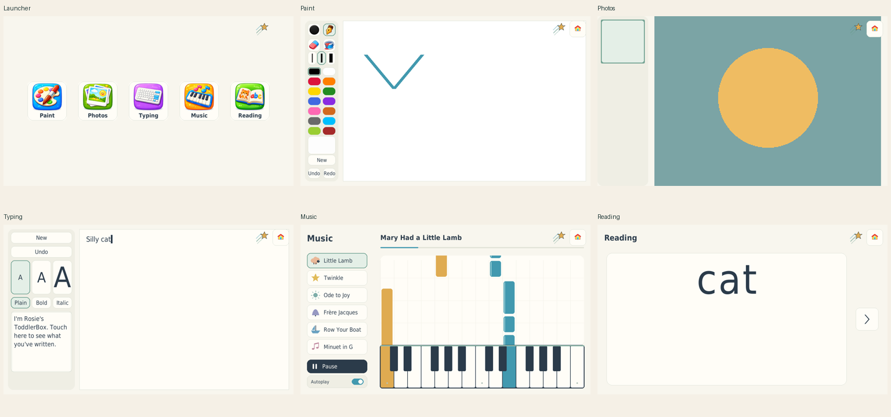
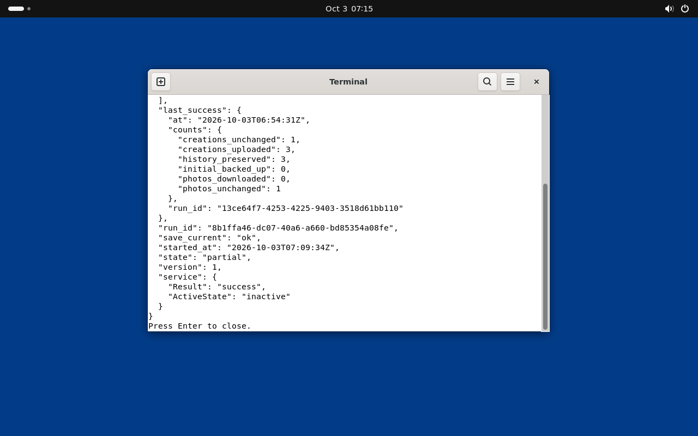

# Bootable system validation — 2026-10-02

The [Reading qualification](#reading-application-qualification) below is the
current result for release **`c12b9037f41f5f85`**. Earlier sections retain the
shared interface, Music/repair and initial system results as historical evidence.

This is a development baseline for VM iteration. Hardware, extended operation,
and the remaining failure cases below still require qualification before using
it as the child's everyday system.

## Environment and evidence

The builder is x86-64 Linux with Docker's vfs storage driver. There is no KVM
device or physical graphics/touch hardware available. Guests use QEMU TCG,
`qemu64`, OVMF UEFI, two virtual CPUs, 4 GiB RAM, virtio graphics/disk, a USB
tablet, and no network. Screenshots and keyboard input use local QMP; a separate
serial login provides diagnostics even when the graphical application is frozen.

In this managed workspace, Docker commands used the local socket explicitly:

```bash
export DOCKER_HOST=unix:///var/run/docker.sock
export BUILDX_CONFIG=/workspace/.cache/buildx UV_CACHE_DIR=/workspace/.cache/uv
unset DOCKER_CONTEXT DOCKER_TLS DOCKER_TLS_VERIFY DOCKER_CERT_PATH
```

The inherited Docker proxy configuration was retained. No network access is
needed by a running guest or by the finished installer.

QEMU's `max` CPU caused GNOME's software renderer to crash on AVX2 instructions
under TCG. The `qemu64` configuration passed the desktop checks. This is a VM
configuration finding, not a diagnosis of the HP laptop.

## Completed checks

The initial integrated qualification used release `88ac086773976b6a`:

| Check | Observed result |
| --- | --- |
| Fresh image boot | First boot required creation of the parent password; no default password |
| Standalone child session | GDM started Cage on a Wayland seat; no child GNOME shell; fullscreen launcher visible |
| Parent recovery with a frozen app | After SIGSTOP, holding Ctrl+Alt+Home switched to parent login and terminated the stopped app |
| Parent desktop | Password authentication reached Ubuntu GNOME; no repeated renderer crashes with `qemu64` |
| Return to child | Administrative child-mode command restored the launcher and healthy frames |
| Saved work | Typing autosaved `savedwork`; the document restored after forced termination, reboot, and return to child mode |
| Repeated hangs | Four successive SIGSTOP injections produced exactly three restarts, then a persistent parent recovery latch |
| Recovery reboot | Parent mode persisted across reboot |
| App release switching | Installed a second bundle, retained the previous release, rolled back to `88ac086773976b6a`; saved typing remained unchanged |
| Rollback without a previous release | Refused with a nonzero command result |
| Installer cancellation | Incorrect erase confirmation left the blank VM target untouched |
| USB installer path | Booted ISO, verified payload checksum, wrote 12 GiB disk, expanded root to the 16 GiB target, powered off |
| Installed disk | Booted without ISO, required parent setup, entered healthy child mode, then reached GNOME parent login |

The installer test exposed BusyBox replacing the standard `dd` path during
initramfs generation. The recipe now bundles GNU dd at a dedicated path; the
successful installation used that correction. The final release also narrows
shutdown signals to the Python application, preserving its opportunity to save
before the compositor is stopped. Build assembly releases its temporary export
container before constructing disks to reduce peak storage use.

Local evidence is retained under ignored `build/`: `vm/fault-result.log`,
`vm/rollback-result.log`, `vm/qualified-restored-typing.png`,
`vm/qualified-parent-desktop.png`, `install-vm/install-result.log`,
`install-vm/installed-result.log`, and `install-vm/installed-parent.png`.
VM password files are disposable local test credentials and are not in images
or tracked source.

## Automated checks

`uv run --offline pytest -q`: **65 passed**. Coverage includes interrupted
writes, failed fsync, simulated ENOSPC, preserving previous saves and in-memory
work, current-document restoration, corrupt-save preservation, legacy typing
archives, startup retry exhaustion, and the independent escape chord.

Shell syntax, systemd unit verification, and `git diff --check` passed. Image
assembly compares the raw and QCOW2 disks byte-for-byte with `qemu-img compare`
and generates artifact SHA-256 checksums.

## Final build artifacts

The completed build produced release **`f903c7e5135a9dc9`**, using Ubuntu 24.04
and kernel `6.8.0-142-generic`. `build/final-build.log` records the successful
build and raw/QCOW2 comparison. All three checksums were independently rechecked
with `sha256sum -c SHA256SUMS`:

```text
a1e0006f2beff01d3b2e4d60be2b64a94fc03fda7b41fc9e6d0476821e208e8e  toddlerbox.img
64764ea45c933eb711f79fb16ba01c8b2d9f5770cd8b6a54b6191d6bea82180c  toddlerbox.qcow2
c6f088371851de553761b42c0bf6f3d9b5c0a58417b40d1e3dcc120f10133ee8  toddlerbox-installer.iso
```

The host VM helper subsequently gained separate UEFI variable files for baseline
and installation disks. Reusing the baseline firmware state had selected the
UEFI shell instead of the installer. Fresh firmware booted the final ISO. This
helper-only change does not modify the system image or its release identity.

The final ISO was then installed to another fresh 16 GiB VM disk. Payload
verification, disk writing, filesystem expansion, shutdown, first boot, and
parent password creation passed. The installed release reported
`f903c7e5135a9dc9`, a 16 GiB root filesystem, healthy child frames, and zero
retries. Paint drew and restored a stroke after returning Home; Photos opened
its empty-library view; Typing saved `finalwork`. Evidence is in
`build/vm/final-install-result.log`, `final-installed-result.log`,
`final-launcher.png`, `final-paint-restored.png`, `final-photos.png`, and
`final-typing.png`.

On the final release, entering parent mode saved the newly added `z` in
`finalworkz`; returning to child mode produced healthy frames. SIGSTOP followed
by the two-second parent chord removed the frozen Python process and reached
the GNOME parent login. The first GNOME greeter took roughly a minute to become
usable under TCG; this is not a hardware recovery-time measurement.
Parent password authentication then reached the ordinary GNOME desktop on the
final release (`final-parent-desktop.png`), with an active parent seat session
and no kernel-reported segfaults during this boot.
Selecting **Start ToddlerBox** from GNOME search and authenticating through
polkit returned to the fullscreen child launcher, with healthy frames and zero
retries (`final-returned-child.png`). The final installed test disk is retained
at `build/vm/install-target.qcow2`; the VM was shut down after validation.

## Remaining qualification

- Physical USB boot/install, HP graphics and touchscreen edges/multiple fingers,
  keyboard/trackpad mapping, cold boots, and parent sleep/resume.
- Secure Boot: the initial installer is unsigned; qualification requires it disabled.
  The installed system requires x86-64 UEFI, even though the installer also boots BIOS.
- Extended soak with memory, process, log, and save measurements.
- Whole-guest disk exhaustion and abrupt virtual power cuts during saves; simulated
  write failures are covered, but they do not establish physical storage behavior.
- Deliberately broken startup in the VM, beyond the unit coverage of retry
  policy; explicit GRUB parent-recovery selection. Controller KILL/SIGSTOP
  recovery was subsequently qualified below.
- Installation refusal cases beyond cancellation: undersized targets, mounted
  filesystems, installer-media targets, and damaged payloads.

The existing HP session and the cause of its previous instability remain unknown.

## Music and repair qualification

The integrated implementation is committed in `fbee06e` (Astra repairs) and
`b28d7eb` (Music and integration). The final build is release
**`e65218acd46d664e`**, produced by `./system/build.sh` from the shared Ubuntu
24.04 recipe. `build/music-final-build.log` records the build and successful
raw/QCOW2 comparison. The release ID matches `system/source-id.py`; generated
Python package metadata is excluded from that identity.

### Automated and asset checks

- `UV_CACHE_DIR=/workspace/.cache/uv uv run --offline pytest -q`:
  **178 passed**. This includes pointer ownership/duplicate suppression,
  drawing/save regressions, bounded caches and archives, preservation on storage
  errors, release compatibility, and Music playback/state/cleanup behavior.
- Shell syntax and `git diff --check` passed. Controller credential/pidfd tests
  use simulated boundaries where the workspace sandbox blocks kernel operations;
  the real guest controller checks below complement them.
- Regenerating all 14 Music outputs offline produced byte-identical files.
  Preparing the piano inputs again from the cached, pinned upstream samples also
  reproduced the committed inputs. Six decoded tracks contain audio without
  clipping, have initial onsets within 50 ms of their first cues, and end quietly.
  These are asset measurements, not physical speaker latency or human listening.
- Launcher and Music screenshots were inspected at 1024×600 and 1366×768.
  The committed [Music screenshot](assets/screenshots/music.png) illustrates the
  passive keyboard visualization. Source, arrangement, instrument and recording
  provenance is recorded in [the asset documentation](assets/music/README.md).

### Actual guest checks

Recovery fault injection used release `53cf9f20f23af22c`. Its application,
controller and bundled Music code/assets match the final release; subsequent
changes corrected the host's fresh-overlay UEFI state and source identity
calculation. The final release was separately installed and exercised below.
Guests used x86-64 TCG, a standalone Cage Wayland child session, PipeWire and
emulated Intel HDA, with QEMU recording audio to a WAV file.

| Check | Observed result |
| --- | --- |
| Child session | Fullscreen four-activity launcher, healthy frames, zero retries, no child GNOME shell |
| Music output | Nonzero captured PCM; selection, automatic track advancement and resumed playback produced output |
| Controller SIGKILL during Music | Systemd restarted the controller in persistent parent mode; old child exited and audio capture stopped advancing; GDM was active |
| Controller SIGSTOP | The 10-second systemd watchdog aborted the stopped controller; restart reached persistent parent mode, removed the old child and activated GDM |
| Parent authentication | Password login reached the ordinary GNOME desktop after recovery |
| Recovery reboot | Parent recovery latch survived reboot; the greeter remained available |
| Independent parent chord | With the launcher deliberately stopped, holding Ctrl+Alt+Home for 2.5 seconds entered parent mode and removed the frozen process |
| Final ISO installation | Booted the final ISO on a fresh 16 GiB target, verified its payload, wrote the disk, expanded ext4 and powered off |
| Installed final disk | Booted without the ISO, completed parent password setup and entered healthy child mode; release ID and all six bundled WAV hashes matched |
| Installed Music | Played from the installed disk and advanced automatically through the song list to Minuet |
| Installed pause/resume | Paused note-field screenshots matched exactly and captured PCM was zero; playback resumed afterward |
| Installed Home cleanup | Returning Home from Music produced zero captured PCM |
| Installed Paint | A single-click dot remained after Home and re-entry |
| Installed Photos | Opened the empty-library view |
| Installed Typing | `musicready` restored after Home and re-entry; the added `z` was present in `current.json` after parent transition, yielding `musicreadyz` |

The final installed root filesystem reported 16 GiB with approximately 13 GiB
available. Local logs/screenshots are retained under ignored `build/vm/`:
`music-controller-kill.log`, `music-controller-stop-verified.log`,
`music-reboot-parent-status.log`, `music-app-chord-recovery.log`,
`music-parent-desktop.png`, `music-final-installer.log`,
`music-installed-status.log`, `music-installed-playing.png`,
`music-installed-pause-a.png`, `music-installed-pause-b.png`,
`music-installed-home.png`, `music-installed-paint-restored.png`,
`music-installed-photos.png`, `music-installed-typing-restored.png`, and
`music-installed-parent-save.log`. Disposable VM credentials remain local and
are excluded from source and installation media.

### Final artifact checksums

All system and application bundle checksums were independently verified:

```text
eb73f17803f7702633a734ab14961d234b5ca0c3f199923515f95bab9dfce6f3  toddlerbox.img
b85540b157d15423cfe22095e3a3e732a3718d2190547ea987a181104e82dc2e  toddlerbox.qcow2
7b01f930389c8eadf41fb1d5dcd388b798f90d6bd9d82c6cd29e75b9ab09640c  toddlerbox-installer.iso
48652ba0e32c9ea40396eff4b51b9bad5b9e77195041302ce635c723dc5e9ca7  toddlerbox-app-e65218acd46d664e.tar.gz
```

### Limits of this qualification

Physical HP touch routing and edge gestures, graphics, keyboard/trackpad,
speaker volume and audiovisual timing, USB installation, and sleep/resume still
need hardware qualification. Human listening to the arrangements and a
multi-hour representative-content soak are also outstanding. The existing
whole-guest ENOSPC, abrupt power-cut, interrupted release-switch, startup and
installer-refusal gates remain open; simulated storage failure tests do not
establish durability on the HP. The Music changes do not require a network at
runtime, and no claim of physical hardware validation is made.

## Shared interface qualification

The shared theme is implemented in `17bda97` and `9d75b46`. All four activities
use the same background, card, typography and selection colors, with a common
58px Home control. The original app/tool/Home artwork is retained; Music adds
a matching illustrated launcher icon. Document geometry, Paint pixels and
persistence/recovery algorithms are unchanged.

- **178 tests passed** after the final icon changes.
- Screenshots were inspected at 1024×600 and 1366×768, including empty and
  populated Photos, and the [combined preview](assets/screenshots/overview.png).
- Release **`6bf84a8245b3f9b6`** uses the existing pinned Ubuntu base and image
  tools with the current `Dockerfile.release` and `make-images.sh` recipe.
  `build/style-final-build.log` records successful assembly, filesystem checks
  and identical raw/QCOW2 contents. The source identity matches the checkout.
- All four artifact hashes were independently verified. The new ISO contains
  the same assembled system payload as the VM disk. The ISO's erase/write/expand
  installation path was qualified in the preceding Music release; this visual
  update does not change that path.

The final disk booted in a fresh x86-64 UEFI/TCG overlay, completed parent
password setup, and entered a healthy standalone Cage child session with zero
retries. All four activities were opened through the illustrated launcher;
their common Home control returned to the launcher. Paint's single-tap dot and
Typing's `style` text restored after Home and re-entry. Music produced nonzero
captured PCM during playback (peak 3751) and zero PCM after Home. A parent-mode
transition then preserved `style` in the current Typing document and stopped
the child cleanly. Evidence is under `build/vm/`: `style-guest-status.log`,
`style-smoke.log`, `style-overview.png`, and the individual `style-*.png` captures.

```text
11f134be07e7117ad7c9b08aa24772b9f3fe76c1c3b82da73a9cb1d30cbbbe78  toddlerbox.img
1881810c49f7fa7744884d75d120ba0bef294fcab71e2685e76b7316d0e8f8e8  toddlerbox.qcow2
5b9a8675936a9d3df886a923bcd909eeddccbb9c681b7b99df680030204c38aa  toddlerbox-installer.iso
e1f4d7853b7538a25b7a77a0639328edc211e79d05913d109c4dc51e1c7db725  toddlerbox-app-6bf84a8245b3f9b6.tar.gz
```

### Bounded extra storage check

Astra independently used a disposable overlay over the qualified `e65218acd46d664e`
installed disk; the base disk was mounted read-only and its modification time
remained unchanged. Installed application save methods targeted a 32 MiB ext4
loop filesystem inside that guest. Filler writes reached actual ENOSPC.
Typing's attempted save returned failure, and subsequent independent read-only
inspection found the valid previously committed text `prior`, preserving it
against the attempted `priornew` replacement.

This is one actual guest data-filesystem save-failure observation. Paint's tiny
PNG still fit in the remaining space, so its expected-failure assertion did not
pass and the rest of that test was not reached. Whole-root exhaustion, controlled
power cuts, and Paint preservation under actual ENOSPC remain open. Host build
storage exhaustion also occurred during follow-up; the agent stopped new fault
writes and kept later inspection read-only. That host event is not a guest
storage-test success. Evidence and limitations are retained in ignored
`build/storage-qa/RESULTS.txt`, `serial.log` and `enospc.sh`.

The installer build was completed after reclaiming disposable build staging,
unused intermediate Docker images and build cache. Qualified VM disks were
preserved. Physical HP, listening, extended-operation and other previously
listed qualification limits remain unchanged.

## Reading application qualification

Reading adds 30 illustrated words, alphabet sound/name decks, and numbers 0–30.
The shared launcher now fits five icons in centered rows where required.

- **201 tests passed** in 4.14 seconds: 178 existing tests plus 23 Reading checks.
- All **158 source assets and 189 prepared outputs** passed SHA-256 verification.
  A separate rebuild reproduced every prepared file and catalog byte-for-byte.
  Independently regenerating all 31 number WAVs with the locked Piper preparation
  environment reproduced their hashes exactly.
- Screens were inspected at 800×600, 1024×600, 1280×800 and 1366×768, including
  the word-first, sound-highlight and picture states, letters, numbers and the
  five-icon launcher. Automated layout coverage also includes 1024×768.
- A bounded dummy-SDL run made **1,000 random selections** after 100 warm-up
  selections with no immediate repeats. RSS increased from 32,984 to 34,428 KiB;
  the maximum selection-plus-render time was 9.245ms. This is a short local
  allocation/responsiveness check, not a multi-hour hardware soak.
- Source/derived media licenses and the differing recorded voices are documented
  in [assets/reading/README.md](assets/reading/README.md). Original media and
  editable drawings are included. Human listening/pronunciation review remains
  outstanding; decoding and waveform bounds do not establish pedagogical quality.

### Built system and actual guest checks

Release **`c12b9037f41f5f85`** was built with `./system/build.sh` from the shared
Ubuntu 24.04 recipe. Filesystem checking, raw/QCOW2 comparison and independent
verification of all four artifact checksums passed. The source identity matches
the application/configuration used for these checks.

The fresh x86-64 UEFI/TCG overlay required parent password creation, then opened
the five-activity launcher in standalone Cage. The controller reported healthy
frames, zero retries and no child GNOME shell.

| Check | Observed result |
| --- | --- |
| Word-first interaction | The initial card had no picture; tapping played the sequence and revealed the illustration |
| Captured speech | Nonzero PCM, peak 7276; this verifies output, not pronunciation or physical loudness |
| Next and Home | Next changed the word; both controls interrupted speech and subsequent captured PCM was zero |
| Shared audio | Music → Reading → Music worked in the shared process |
| Other activities | Paint's dot and Typing's `reading` restored after Home/re-entry; Photos opened |
| Parent-selected decks | Lowercase sounds, uppercase letter names, and number 23 played and revealed their illustration/quantity |
| Actual data ENOSPC plus damaged media | A dedicated 16 MiB ext4 loop filesystem reached zero available bytes; a 4096-byte write failed ENOSPC. With this as Reading's data root and a corrupt `cat` sequence, remaining cards still played/revealed, Next/Home worked, and the controller retained zero retries |
| Independent frozen-app escape | After SIGSTOP during Reading, the held parent chord removed the stopped launcher, persisted the parent latch, reached GNOME login and left zero captured PCM |

The recovery harness's first fixed 12-second host wait was too short under TCG.
Subsequent independent serial checks confirmed parent mode, absence of the stopped
PID, and the controller's exact reason: `Ctrl+Alt+Home held for two seconds`.
This is not a physical recovery-time measurement. The storage fixture was removed,
the original configuration restored, and the original recording hash rechecked.
This bounded Reading test does not qualify whole-root exhaustion or Paint saves.

The final ISO then installed onto a separate blank 16 GiB virtual disk. Payload
verification, disk writing, filesystem checking/expansion and shutdown passed.
Without the ISO attached, that disk required parent password setup and reached
healthy child mode with zero retries. Its root filesystem reported 16 GiB with
13 GiB available; all 189 Reading output hashes matched. Reading played speech
(captured PCM peak 7284), revealed its picture, and stopped cleanly on Home
(zero PCM). Typing saved `reading`, and an administrative transition entered
persistent parent mode.
Password authentication started an active parent seat session with `gnome-shell`;
an administrative return to child mode restored the fullscreen launcher, healthy
frames and zero retries. The saved Typing text remained `reading`. Parent session
authentication/process state was verified over serial; the desktop's finished
render was not separately captured in this Reading pass.

Local evidence includes `build/reading-final-build.log`, `build/reading-preview/`,
`build/reading-rebuild/`, `build/reading-number-check/`,
`build/reading-selection-check.json`, and `build/vm/reading-{guest-status,smoke,decks,storage-fault,recovery-verified}.log`.
Screenshots and captured audio are retained under ignored `build/vm/`.
Installer evidence is in `build/vm/reading-installer.log`,
`reading-installed-status.log`, `reading-installed-smoke.log`, and
`reading-installed-results.json`, plus `reading-installed-parent-status.log` and
`reading-installed-return-child.log`; the installed disk is retained at
`build/reading-install/disk.qcow2`. Earlier qualified disks were preserved.

### Artifact checksums

```text
6f34008d9526e3a9a72cf66ef6d2b962071698f498d40d66d661f34cf02a7b23  toddlerbox.img
5eff20ed23636c84f7f1edebb93486d255eafa1afde36980090559d6f81cb4a9  toddlerbox.qcow2
059af6824818796db59aa35d4ad0ca086e788e81e1a94782c579ac41cb86ecb4  toddlerbox-installer.iso
f2b66b58b8be1c994937c9c9c27f5e7850ac1d0ac0d5e0aa666ac1a9f7e9b3c8  toddlerbox-app-c12b9037f41f5f85.tar.gz
```

HP touchscreen/graphics/speakers, USB boot on physical hardware, sleep/resume,
human listening and multi-hour operation remain unqualified. Earlier open
whole-root/power-cut/startup/installer-refusal gates also remain open.

## Preparing a USB after qualification

Check `build/SHA256SUMS`. In Ubuntu Disks, select the intended USB device and use
**Restore Disk Image** with `build/toddlerbox-installer.iso`; this replaces the
USB's contents. Boot it on the backed-up target computer in UEFI mode. The
installer separately identifies the internal target disk and requires an exact
erase phrase before replacing that disk. On first boot, set the parent password.
Preserve `/var/lib/toddlerbox` before any reinstallation.

## On-demand Drive sync — feature qualification

Feature baseline is the actual Git commit
`e726201b2d201bc31c2136860bc48e7ee7750017`; `origin/main` was fetched again and
remained there. An unmodified `git archive` of that commit is retained under
`build/drive-sync-qa/baseline-source`. Both versions were checked in the same
Linux environment with uv 0.12.19, CPython 3.12.14, pygame-ce 2.5.8 / SDL 2.32.10,
Pillow 12.3.0, PyYAML 6.0.3 and pytest 9.1.1 from the frozen project dependencies.
The unmodified baseline passed **201 tests**; the current feature passed
**253 tests** in 5.04 seconds. The actual AF_UNIX credential integration test
requires Unix-socket permission in a sandbox; its initial denied `bind()` was a
sandbox limitation, and it passed when that permission was provided. Linux
credential/pidfd checks were retained; Darwin does not supply those APIs.

Intended differences: explicit ctrl-alt-s sync and its transient receipt;
root-owned copy/import/recovery tooling; acceptance of large JPEG/MPO primary
frames through bounded decoder reduction. Invariants: unchanged inactive UI,
unchanged saved content, independent parent escape/watchdogs, existing durable
save paths, no cloud deletion propagation, no implicit job starts, and no private
credentials/family data in source or image artifacts.

Repeatable host commands (all fixtures are synthetic):

```sh
mkdir -p build/drive-sync-qa/baseline-source
git archive e726201b2d201bc31c2136860bc48e7ee7750017 | tar -x -C build/drive-sync-qa/baseline-source
PYTHONPATH="$PWD/build/drive-sync-qa/baseline-source/src" \
  SDL_VIDEODRIVER=dummy SDL_AUDIODRIVER=dummy uv run --frozen pytest -q \
  build/drive-sync-qa/baseline-source/tests
SDL_VIDEODRIVER=dummy SDL_AUDIODRIVER=dummy uv run --frozen pytest -q
uv run --frozen python scripts/check-sync-rendering.py \
  --baseline build/drive-sync-qa/baseline-source \
  --output build/drive-sync-qa/rendering-check
./system/build.sh
```

The rendering harness imports the actual archived and current source in separate
processes with identical inputs and dependencies. At 1024×600 and 1366×768,
**24 inactive/expired receipt frames match exactly**, all **12 active frames**
differ only inside the 48×48 receipt area, and **24 saved-output comparisons**
match byte-for-byte. These include Paint PNG, Typing JSON, photo thumbnails and
nonuniform oriented JPEG/MPO decoder hashes/dimensions. Music and Reading use
the actual run-loop flip hooks. Contact sheets were visually inspected.



Focused checks cover one-keyboard/repeated/rearmed holds and parent priority;
credential/nonce/PID/generation checks and five-second save expiry; actual kernel
rejection of unprivileged app packets; stable upload inputs despite subsequent
edits and rejection of an in-place snapshot race; partial save results; preserved
history with checksum verification before replacement; interrupted download,
offline, authentication and disk-reserve failures; concurrent-job exclusion;
actual stalled-subprocess termination; killed/timed-out status reconciliation;
verified/repeatable package import, private transfer consumption only after
success, path traversal/symlink/hardlink/case collisions; explicit Recall restore;
and the actual Mac package helper's synthetic round trip.

Synthetic 49,766,400-pixel JPEG and two-frame MPO containers are assembled from
small encoded blocks without allocating a full source pixel image. Thumbnail,
main-image and importer paths reduce before decode and preserve original bytes.
The largest importer decode observed is 4096×3038 (12,443,648 pixels); full-resolution
and PNG paths still reject above 40M pixels, JPEG headers above 80M are refused,
and animated PNG remains rejected. Ubuntu's actual root-worker Pillow 10.2.0
also passed the JPEG/MPO/PNG checks. No global Pillow bomb limit was raised.

The pinned snapshot supplies rclone `1.60.1+dfsg-3ubuntu0.24.04.6` (its binary
reports `v1.60.1-DEV`) and system Pillow `10.2.0-1ubuntu1.3`. An actual packaged
rclone local-file listing confirmed the lowercase `md5` field used by the adapter.
The Mac's rclone 1.75.1 is a separate runtime; builder tests never contact Drive.

Build/installed-VM evidence and final artifact identity follow below. Local Google
results are explicitly attributed to local orchestration; physical HP testing,
USB media readback and extended operation remain separate acceptance gates.

### Local private acceptance evidence (reported by local orchestration)

No private input was transferred to this builder. The local Mac reports:

- All **102 original photos**, **112,575,331 bytes**, imported through the actual
  worker after the MPO compatibility fix, with every original SHA-256 unchanged.
- Actual e726201 versus bf48568 Photos outputs: all **99 previously supported
  originals** have identical main/thumbnail RGBA hashes, sizes and orientation;
  **three** 49,766,400-pixel JPEGs are newly supported. The 30 MPO JPEGs retain
  their baseline output exactly after restoring the shared draft path.
- The same public render harness passed 24 unchanged frames, 12 bounded overlay
  differences and 24 saved-output comparisons on the Mac; the synthetic overview
  was visually checked. Its focused Drive-worker suite passed **41 tests**.
- Disposable real-Drive tests with the parent's own Production Desktop client
  and exact drive.readonly + drive.file scopes passed using rclone **1.75.1** and
  separately official Mac rclone **1.60.1**: a picture created by a separate
  Desktop client was read/downloaded, Paint/current and archived Typing uploaded,
  UTF-8 exports verified, old Paint/Typing bytes verified in History before
  replacement, explicit restore preserved newer local work, save timeout marked
  partial while preserving last success, and local deletion did not delete cloud
  work. Original Photos and Initial backup deposits were individually verified.

These are local reports, not builder cloud tests. The Mac 1.60.1 build differs
from Ubuntu's security-patched package and Go toolchain; installed-VM checks of
that exact package are recorded separately.

### Built image and installed-VM evidence (2026-10-03)

The tested image was built from exact commit
`bf48568a02ead0e7da80ac34c93d9e047d412ad5`, with installed content/release ID
`374e31452f4672ea`. Subsequent documentation, consent-site and transfer-metadata
commits do not change the bytes of this candidate. The build completed filesystem
checks, compared raw/QCOW disk contents, and verified the installer payload. The
public artifacts contain no Google credentials or family media. Before cleanup,
the image's private config/state and photo library were checked empty.

The installer booted under x86-64 QEMU/UEFI using **TCG**, two CPUs and 4 GiB RAM,
with **no virtual NIC** and an independent serial console. It verified the payload,
installed to a new 16 GiB virtual disk after the exact erase confirmation, passed
filesystem checks/resizing, and shut down. That installed disk then booted without
the ISO. Previous qualified Reading/Music/system VM disks were preserved.

The installed system reports Ubuntu 24.04.5, kernel 6.8.0-142, Python 3.12.3,
pygame-ce 2.5.8 / SDL 2.32.10, app Pillow 12.3.0, root-worker Pillow 10.2.0,
and packaged rclone `1.60.1+dfsg-3ubuntu0.24.04.6` / `v1.60.1-DEV`, Go 1.22.2.

| Installed-VM check | Observed result |
| --- | --- |
| Fresh boot | Standalone Cage child session, no child GNOME shell, healthy frames, zero retries; sync static/inactive and initially never run. |
| Actual keyboard and graphics | `ctrl-alt-s` without Shift produced visible receipts on launcher and all five activities; every continuous hold faded without repeating, and release rearmed it. |
| Authentication and setup | Forged child-origin packets refused; root-only configuration/state and 0600 credentials inaccessible to child. Synthetic large MPO setup imported original bytes and started no job. |
| Actual Ubuntu rclone without networking | Explicit request ended as partial/offline-or-unreachable; authenticated durable save succeeded and child remained healthy. |
| Synthetic transport through actual service | Initial backup, photo download, Paint/Typing uploads and UTF-8 exports completed with success and persisted counts. No real provider was contacted. |
| Save/upload race and History | Editing Typing after private staging changed local work while uploaded bytes stayed exactly equal to the acknowledged earlier snapshot; three replaced cloud files were preserved. |
| Active-job exclusion and receipt | A further hold visibly rendered the star while worker PID and child session stayed unchanged. Concurrent setup returned busy and retained its transfer archive. |
| Frozen-app parent escape | With a stalled transfer and stopped launcher, Ctrl+Alt+Home reached parent mode and removed the frozen child process; worker PID remained unchanged. |
| Watchdog during stalled sync | Startup stall and separately a previously healthy event-loop freeze recovered to healthy child frames; old PIDs disappeared while the root worker continued unchanged. |
| Killed and timed-out jobs | Actual SIGKILL recorded interrupted; systemd timeout recorded timed_out. Both retained the earlier successful completion/counts. |
| Actual full photo filesystem | A disposable 16 MiB photo filesystem was filled to ENOSPC. Publication was refused, old files survived, partial failure was recorded, and last success remained. |
| Repeat setup and consumption | Same verified package preserved UUID, credentials, current work and downloaded photos, then consumed only the successfully installed transfer archive. |
| Parent GNOME and desktop tool | Authenticated parent login rendered GNOME, normal keyboard search found the tools, and the Sync Status entry opened its authenticated terminal with the expected partial/last-success record. Return to child restored healthy Cage frames. |
| Repeated installed boot | Healthy standalone child session with zero retries, UUID and saved-file SHA-256 values unchanged, last run ID unchanged, no automatic sync, no NIC, no remaining QA override, and production timeout still 15min. |



Fault-injection overrides existed only under `/run/systemd/system` in the
**installed disposable VM**, never in the ISO. The transport fixture was a local
synthetic executable bind-mounted over rclone while retaining the production
service sandbox. A first fixture location under `/run` was refused by its noexec
mount; moving that fixture into private executable state fixed the harness without
removing the guard. The timeout check shortened only `TimeoutStartSec` to 12s;
production was checked at 15min before and after. All overrides were removed.
The photo ENOSPC test used a separate mounted filesystem and then restored the
original library. Fixed-delay visual/startup assertions were replaced with bounded
waits for actual pixels or healthy frames under slow TCG; they are not reported
as product passes until the corresponding observable check passed.

The build/VM logs and synthetic screenshots are retained in
`build/drive-sync-qa/` and `build/vm/`; the committed receipt contact sheet is above.
To repeat the faults after a fresh installation, use independent serial access:
request sync with `sudo toddlerbox-sync run`, inspect `sudo toddlerbox-sync status`,
stop only its worker with `sudo systemctl kill --kill-whom=main -s KILL toddlerbox-sync`,
and inspect the resulting interrupted record. For a stalled-transport test, put a
synthetic `#!/bin/sh` / `exec /bin/sleep 600` fixture under private executable state
and use a temporary runtime service `BindReadOnlyPaths=...:/usr/bin/rclone` override.
Keep all production restrictions. While the worker is stalled, send actual
key-down/key-up events for the two-second chords, freeze only the identified
launcher PID with SIGSTOP, and verify replacement PID, healthy frames, parent
transition and unchanged worker PID. Remove the override and daemon-reload before
checking production timeout and reboot behavior. Never run these destructive
fault fixtures on the child's live computer or against real Drive data.

Artifact SHA-256 values:

```text
67a11431ee0d98998fac70c34f10a175886757a05c9a5aa4ba3be51a80b5049f  toddlerbox.img
c9088485420f88e73cb7a3d2cec80411f391db154174f521708a0f7852d9772a  toddlerbox.qcow2
def9b5cfcd55e4ebc2c66938b5b43006f584ae49d620ddd1ab3d5d607bf92fa4  toddlerbox-installer.iso
e5240d239e08d738bc4fb975a9cae3db0154a3924d688649d350274e16438e5b  toddlerbox-app-374e31452f4672ea.tar.gz
```

The installer is **1,530,040,320 bytes**. All 183 temporary public transfer chunks
were uploaded and are listed in
[the complete checksum manifest](docs/builds/374e31452f4672ea-transfer.json).
The local Mac reports reassembly and an independent full-file SHA-256 reread both
matched. Local orchestration owns publishing ordinary assets on release
`candidate-drive-sync-374e31452f4672ea` (GitHub release ID 402370934), merging the
reviewed PR, switching Pages to main/docs and flashing/readback of the USB. The
builder's ordinary upload endpoint returned HTTP 400 Bad Content-Length even for
255 bytes; the approved temporary blob route succeeded without binary commits.

Limits: TCG/UEFI VM qualification does not establish HP touchscreen edges,
multitouch, graphics, speakers, USB/Secure Boot compatibility, sleep/resume,
physical power-loss durability, whole-root ENOSPC or extended soak performance.
The actual Ubuntu rclone binary was exercised offline and with a local listing;
real Google transport checks used the separately reported Mac builds. Drive
operations through rclone cannot provide atomic compare-and-swap against another
writer changing the same cloud file after the worker's last check. The documented
history/checksum safeguards apply; simultaneous external editing remains a limit.
The application archive alone does not install the system/controller feature:
use the qualified installer with backup verification and human confirmation of
the exact physical target disk.

### Local publication and rollout checkpoint

PR #4 was merged into `main` as `c4deb889da1dc97a303d62b7cad3fbc9edccfd68`.
The Mac checkout was fast-forwarded to that merge without staging unrelated
Finder metadata deletions. GitHub Pages was switched to `main /docs`, built from
the merge, and both public consent pages matched the merged HTML byte for byte.
The ordinary installer asset is published on
[the qualified Drive sync prerelease](https://github.com/famulare/ToddlerBox/releases/tag/candidate-drive-sync-374e31452f4672ea);
its GitHub asset size and SHA-256 were checked against the independently reread
local ISO. Image identity remains `374e31452f4672ea` from `bf48568`; later changes
record delivery and qualification without changing the built runtime.

The personal Mac separately verified all 102 originals in Photos and the
permanent initial Drive backup, preserved a second local copy, and checked all
105 regular files in the private setup archive. Private credentials, originals,
manifests and local test records were moved outside the public checkout. A
102-photo SHA-256 companion and private recovery instructions support checking
the physical laptop import before deleting transfer copies.

**USB flashing remains unperformed.** Official balenaEtcher 2.1.7 was downloaded,
checksum-verified, signature-verified and accepted by Gatekeeper as notarized.
Repeated computer-use bridge timeouts prevented obtaining current controls
before selecting the ISO or target. The approximately 16.4 GB external blank
TODDLERBOX USB remains unchanged. No administrator prompt or successful flash
is claimed. The parent recovery guide records the exact local ISO, GUI flashing
and validation steps, managed-Mac authorization options, private import steps
and physical acceptance checklist. Physical laptop disk selection and erase
confirmation remain the parent's action.

## First HP controls patch — focused validation

Base: actual main `0e246e291ff50bddadad5044f5e3a7c97521680c`.
An unmodified archive passed **253 tests** in the same frozen Linux Python
3.12.14 / pygame-ce 2.5.8 / Pillow 12.3.0 environment. The patch passed **265 tests**
(4.82s), including media-key actions, child-only execution, bounded autorepeat,
nonblocking timeout/cancellation, command-group termination and the actual shell
helper's output selection, unmute and 100% ceiling. Shell syntax checks passed.
The app source, assets, configuration defaults and data schema are byte-identical
to main; no rendered controls, saved-document formats or private Drive files change.

Ubuntu snapshot `20260926T000000Z` authenticated Cage source
`0.1.5+20240127-2build1` was compiled before and after the tap patch, using the
same Ubuntu base/toolchain. The patch applied with no fuzzy matching. Both builds
completed and their actual CLI help output matched exactly. Compiler target:
x86-64, wlroots 0.17.1 / libinput 1.25.0; no Xwayland. The built binary is 205,664
bytes, SHA-256:

```text
1f415b196c3502ac8e41f5785aa3f4c088fd3df10f53e5fd3dbf1712c2b0ffee  toddlerbox-cage
```

Repeat commands:

```sh
SDL_VIDEODRIVER=dummy SDL_AUDIODRIVER=dummy uv run --frozen pytest -q
source system/versions.env
docker build --platform linux/amd64 --target toddlerbox-cage-builder \
  --secret id=proxy_ca,src=/etc/ssl/certs/ca-certificates.crt \
  --build-arg UBUNTU_IMAGE="$UBUNTU_IMAGE" \
  --build-arg UBUNTU_SNAPSHOT="$UBUNTU_SNAPSHOT" \
  -f system/Dockerfile.base -t toddlerbox-cage-check .
bash -n system/bin/toddlerbox-volume system/bin/toddlerbox-session scripts/update-child-controls.sh
```

This budget-limited pass did **not** rebuild or qualify a complete installer/VM,
run the updater on the HP, test real touchpad taps, or establish the cause of its
silent Music output. PipeWire service/routing and physical volume-key behavior
need the hardware follow-up described in [the patch instructions](docs/child-controls.md).
Initial binary publication was blocked by automatic approval review because the
previous transport instruction covered the ISO. The parent subsequently requested
the combined downloadable updater and approved PR #5 after its completion.
The previous qualified installer and VM disk/checksum evidence remain preserved;
user-authorized cleanup removed disposable Docker images/containers/build caches.

## Parent update bundle — focused validation

Same actual unmodified main `0e246e291ff50bddadad5044f5e3a7c97521680c`
and frozen environment: **253 passed** (5.08s). Controls plus updater:
**280 passed** (4.91s). Fifteen additional updater checks exercised actual durable
file replacement/backups/journal, checksum failure and verified-open-descriptor
substitution, parent-only/platform guards, unexpected paths/symlink rejection,
disk reserve, offline apt failure, failed replacement rollback, interrupted-update
recovery, corrupt-backup refusal, repeat-install no-op, app-failure restoration,
and a combined update through the existing production app installer. External
apt/systemctl/ldd calls were replaced with test commands; the file/app installer
code was real. Protected child/private paths remained byte-identical.

Repeat: `SDL_VIDEODRIVER=dummy SDL_AUDIODRIVER=dummy uv run --frozen pytest -q`.
In this managed execution environment, the real AF_UNIX credential test requires
the tool's network permission even though it contacts no cloud service. One run
without that permission failed at socket bind; granting it passed the unchanged
test and both complete old/new suites. Production authentication was not weakened.

The bundle uses only Python's standard library, with a fixed allowlist of system
destinations and fixed package operations. No update job, timer, network poll or
background downloader is installed. Existing data/configuration formats and
child UI are unchanged. Bootstrap and installed-command usage, rollback boundaries
and the explicit power-interruption recovery route are in
[docs/updates.md](docs/updates.md).

Limits: no new full image/VM build; actual HP updater/package transactions,
power-interruption recovery and physical taps/audio remain hardware follow-up.
This patch does not diagnose the unreproduced Paint drag incident. The compiled
compositor is the previously checked snapshot build above; the new bundle packages
it without a compositor rebuild. Whole-OS rollback still uses the preserved USB
image; bundle rollback restores controls/app links and retains audio packages.

The executable update bundle was built from commit
`253350775ad7125f47c9815bf39641bf4e2ce5df`, source content ID
`5e754c3b13e41fd8`: **100,905 bytes**, SHA-256
`6907bb8d89dada2b9e6cf8d6a23d7d16f9a4678b751bdb65a3902a492849cb3c`.
Two actual builds produced identical bytes; the bootstrap `--help` ran, and the
real installer staged/verified all six fixed system payloads. There is no app
payload because this patch leaves application code unchanged.

Ordinary release uploads and an explicit Content-Length upload both failed with
HTTP 400 Bad Content-Length (even the tiny checksum file). Under the renewed
update delivery authorization, a single unreferenced public Git blob was uploaded
and its full API readback matched the bundle byte-for-byte. No binary was committed
to source history. [The manifest](docs/releases/child-controls-5e754c3b13e41fd8.json)
and [download helper](scripts/download-child-update.py) provide checksum-verified
delivery without root privileges or cloud credentials. Later documentation commits
do not change the built payload source identity recorded above.

## First HP Wi-Fi omission — offline repair

The supplied HP kernel log identifies Intel AC 3165 with successfully loaded
`iwlwifi` firmware; NetworkManager reports `wlo1` unavailable. Both original
qualified package records (`build/packages.tsv` and the Drive qualification copy)
lack `wpasupplicant`/`iwd`, libnl and libpcsclite. The build explicitly disables
recommended packages and did not request the Wi-Fi backend. This confirms an
image omission; whether it fully resolves the observed HP issue awaits the repair.

`wpasupplicant` is now explicit in image packages and future parent updater package
operations. The Mac-compatible offline helper downloads five Ubuntu 24.04 amd64
packages (1,750,228 bytes) directly from the same snapshot `20260926T000000Z`.
Package versions/hashes came from the existing authenticated Cage-builder apt
metadata, not guessed URLs. All five actual downloads passed those SHA-256 checks;
`dpkg-deb` checked their package identities/dependencies. All 15 dependency/version
requirements are satisfied by the actual qualified package record plus these five
packages. Bash syntax/diff checks passed; the unchanged full app/system suite
passed **280 tests** (5.06s).

Repeat downloader: `bash scripts/download-wifi-repair.sh` on a connected Mac/Linux
machine; [offline HP instructions](docs/wifi-repair.md) do not need network access.
No family data, credentials or releases are replaced. This is a package repair,
not a rebuilt installer; preserve the original qualified USB. Physical scans and
association remain the HP acceptance check. VM virtual Ethernet could not have
validated Wi-Fi service completeness; the earlier qualification did not claim
physical Wi-Fi acceptance.

## HP feedback: child-paced Reading, playable piano and complete networking (2026-10-04)

Actual baseline: `890f793e9a4082659cd877f29297674f9ee3a114` (main plus the
missing Wi-Fi-backend repair), archived unmodified. Implementation:
`003dda8c2f406f696df6060368652f3197598905`, plus compact-builder directory fix
`9952ee142fd128aeec326161c01ddeb91166b155`; image source content ID
`a60a9ddeca41e3f6`. Independent Sol reviews covered Wi-Fi, Music and Reading
separately, then independently confirmed each targeted repair.

Intended changes: 75 Reading words, seven default difficulty groups, explicit
sound-unit taps and whole-word reveal, scrollable word/picture selector, removal
of number cards/configuration/media; independent sampled piano voices over
unchanged songs and Free Play. Image includes the child-controls repairs already
merged on main, explicit `wpasupplicant`, and `iw`/`rfkill` parent diagnostics.
Parent escape, watchdog, durable saves, Drive privacy and original icons remain
invariants. Reviews caught and resolved fading-note cleanup, `egg` sound grouping,
letter-tap premature reveal, ambiguous bun/gum art and wildcard offline installs.

Same Linux toolchain/inputs: CPython 3.12.14, uv 0.12.19, pygame-ce 2.5.8 / SDL
2.32.10, Pillow 12.3.0, pytest 9.1.1, PyYAML 6.0.3; ffmpeg 7.1.5 for preparation.
Baseline full suite: **280 passed**. Final feature full suite: **290 passed**.
Exact real-source comparison: **8 unaffected frames**, **8 saved outputs** and
**289 existing media files** match. Music and Reading layouts intentionally
change. Existing songs/cues and original word/letter media remain byte-identical.

Repeatable commands (`UV_CACHE_DIR=/tmp/uv-cache` on this restricted builder):

```bash
PYTHONPATH=/path/to/baseline/src uv run --frozen --project /path/to/current pytest -q /path/to/baseline/tests
uv run --frozen pytest -q
uv run --frozen python scripts/build-reading.py --verify
uv run --frozen python scripts/check-child-paced-baseline.py --baseline /path/to/baseline
uv run --frozen python scripts/preview-reading-piano.py
TODDLERBOX_PRUNE_BUILD_CACHE=1 ./system/build-compact.sh
```

The prepared pack verifies 214 source assets and 290 outputs. Synthetic UI
screenshots are committed under `docs/images/reading-{word,picture}-rail.png` and
`music-{play-along,free-play}.png`. Reviews inspected the full word gallery and
small-screen layouts. Tests compare requested PCM slices exactly, exercise real
SDL song/channel concurrency and release-before-cleanup, delayed reveal, bounded
scroll selection, Free Play, source hashes and absence of numbers.

The compact builder uses the same pinned Ubuntu snapshot, Cage source/patch,
package lists, frozen dependencies and rootfs configuration. It avoids duplicated
vfs filesystem layers; its Docker-save extraction and intermediate cleanup are
part of the public recipe. Previous qualified ISO, VM bases and installed
checkpoints are preserved. Fresh-install/image evidence is recorded
below; unit/dummy SDL tests do not establish physical Wi-Fi scanning, touchpad
behavior, pronunciation or HP speaker loudness.

Completed image/VM evidence: compact recipe built from revision `9952ee1`,
Ubuntu snapshot `20260926T000000Z`, content ID `a60a9ddeca41e3f6`. The first
attempt stopped at a missing `/usr/local/libexec` directory; `install -D` fixes
that build path. The successful image installs the same verified Cage binary
SHA-256 `1f415b196c3502ac8e41f5785aa3f4c088fd3df10f53e5fd3dbf1712c2b0ffee`.
Rootfs `e2fsck` passes; raw/qcow2 comparison reports **Images are identical**.
Package comparison with the earlier image has exactly seven additions
(`wpasupplicant`, four libraries, `iw`, `rfkill`), no removals/version changes.

Actual packaged versions: wpasupplicant `2:2.10-21ubuntu0.4`, iw `6.7-1build1`,
rfkill `2.39.3-9ubuntu6.6`, PipeWire/Pulse `1.0.5-1ubuntu3.3`, WirePlumber
`0.4.17-1ubuntu4.1`, rclone `1.60.1+dfsg-3ubuntu0.24.04.6`. Guest Python is
Ubuntu's CPython 3.12.3; pygame-ce/SDL are 2.5.8/2.32.10.

The exact new ISO booted and installed to a separate blank 16 GiB VM disk,
verified its compressed payload, required exact `/dev/vda` erase confirmation,
expanded ext4 and powered off. Booting that installed disk without the ISO
completed first-boot password setup and entered standalone Cage. No KVM or
physical radio is available: QEMU x86-64 TCG/qemu64, two CPUs, 4 GiB RAM,
virtio display, emulated Intel HDA and **no NIC**. Guest checks confirmed:

- `/` on `/dev/vda2`, correct `/opt/toddlerbox/releases/a60a9ddeca41e3f6`,
  absolute `/var/lib/toddlerbox` data root and root-owned executable compositor.
- Healthy controller/GDM/NetworkManager, frame reports with zero initial retries,
  75 default word cards and no numbers; child PipeWire sockets/WirePlumber active.
- `fi.w1.wpa_supplicant1` D-Bus activation succeeds and service is active.
  Zero wireless interfaces is expected in this VM and does not qualify HP radio.
- Sync remains `never-run`/inactive with no credentials, including after reboot.
- Real HDA output: sound tap peak 3979, whole word 4707, Music 1710, free-play
  piano 1716 (signed 16-bit PCM). Picture pixels remain identical after a sound
  tap and change after whole-word completion. Free-play idle and both Home exits
  have exact zero audio peaks. These numbers describe VM output, not loudness.
- Synthetic Linux uinput media events drive the actual independent controller
  and child sink: 0.40 → 0.45 → muted → 0.40/unmuted. Completion is polled because
  volume work is asynchronous; no production deadlines/guards are relaxed.
- A SIGSTOP freeze produces a watchdog GDM restart and a changed launcher PID
  with healthy frames. Two observed recoveries consume attempts 1 and 2.
  Another frozen launcher reaches parent mode through a real QMP
  `ctrl-alt-home` hold; journal reason confirms the two-second independent chord.
  Parent password authentication starts a normal parent GNOME session; explicit
  return restores child mode. Reboot returns to healthy child frames/retries zero.

The repeatable QMP/pixel/HDA check is committed:

```sh
uv run --frozen python scripts/qualify-child-paced-vm.py
# For the separately mounted qualification VM:
TODDLERBOX_VM_DIR=/tmp/toddlerbox-new-vm uv run --frozen python scripts/qualify-child-paced-vm.py
```

Root console checks use `system/serial.py`: `toddlerbox-mode status`,
`busctl call org.freedesktop.DBus /org/freedesktop/DBus org.freedesktop.DBus StartServiceByName su fi.w1.wpa_supplicant1 0`,
`systemctl is-active wpa_supplicant`, package queries and child `wpctl get-volume`.
For a disposable VM only, freeze the exact child `.venv/bin/python -m toddlerbox.launcher`
PID; observe the retry/PID/frame transition, or send
`system/qmp.py human-monitor-command '{"command-line":"sendkey ctrl-alt-home 3000"}'`.
The harness tolerates transient status-file reads while the controller rewrites
its diagnostic JSON; authenticated IPC and health handling are unchanged.

ISO **1,542,178,816 bytes**, SHA-256
`33bf906226fa2db87d87d5e325c4951bbe94a93ca9c911d7822430824ef10066`.
Raw SHA-256 `e47ad87f50940032597369c26ea0ab328d73f45f8dcb1fd46b4b9efd819a5c4a`;
qcow2 `70a4aa78e8946271a2c90990b5536a60d853ac6c287efcfcce076fdc04fbe6a9`.
Metadata/temporary verified transport are under `docs/releases` and `docs/builds`.
No family photos, original private setup packages or real Google credentials are
on this builder/in the PR/image. Earlier qualified ISO and VM bases/checkpoints
remain preserved. Physical flashing, HP wireless scan/association/reconnection,
trackpad/touchscreen acceptance, output routing/loudness and human listening
remain outstanding. See `docs/reinstall.md` for private backup before erasure.

Publication completed through explicit Actions run
[37170634224](https://github.com/famulare/ToddlerBox/actions/runs/37170634224).
It reassembled all 184 public chunks, verified the literal full ISO SHA-256 and
uploaded ordinary ISO/checksum/source release assets. GitHub's asset digest and
size independently match; the published direct download returns HTTP 200.
PR #7 is merged on main (`65b4633`); PR #6 is included/closed as merged.
The image remains revision `9952ee1` / content ID `a60a9ddeca41e3f6`; subsequent
validation/delivery documentation does not alter that built identity. The new
installed VM checkpoint is `build/play-qualified/disk.qcow2`, SHA-256
`8ca8edc23ac602a665407b38222870b87c0dc2bf0f179e81012b08cf51435624`;
its OVMF variables SHA-256 is
`3cc9ac3a14040608c8c4b1bb9319d0216acbc194a4628b4b2a26e437eb8338c0`.
Checkpoint conversion reports identical guest sectors; previous installed disks
are restored to their original paths, alongside all earlier bases/qualified ISO.
Duplicate raw assembly/intermediates and unused caches were cleared; the new ISO
and golden qcow2 remain.
