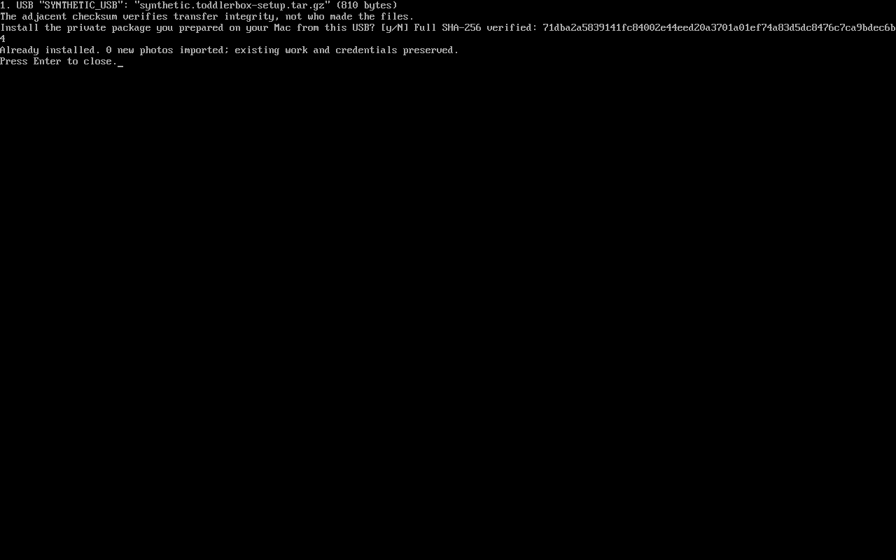

# Private, on-demand Drive copies

Read the [privacy and permission explanation](drive-sync-privacy.md) before
connecting Google Drive. This optional feature uses the parent's own Desktop
OAuth client. The public image contains rclone and the software, not credentials
or family files. Real authorization and family-photo preparation happen on the
parent's Mac, never on the image builder.

## Google and Mac preparation

Use https://famulare.github.io/ToddlerBox/ as the application homepage and
https://famulare.github.io/ToddlerBox/privacy.html as its privacy URL in Google
Branding. Current rclone documentation notes that these fields can be required
to enable Publish even for personal use.

Create a Google OAuth **Desktop app** client, enable the Drive API, and configure
`drive.readonly` plus `drive.file`. Use **Production** consent for normal use.
External applications in Google's Testing mode generally receive refresh tokens
that expire after seven days for these scopes. Personal-use applications may not
need verification, but that does not remove the Testing token limit or guarantee
that Google's console will allow publishing. Confirm the actual console state;
do not assume a disabled Publish action succeeded.

Google can revoke/expire a refresh token after six months of inactivity, and for
other account/security reasons. Reconnect is parent-initiated maintenance, with
no reinstall. Never broaden the requested scopes to work around a console error.

Using uv and an installed rclone on the Mac, the preparation helper can authorize
a browser session, create and pin the root folder, deposit verified originals,
and build the private archive. It requires private output outside the checkout:

```sh
uv run python scripts/prepare-drive-setup.py authorize \
  --private-dir /private/path/toddlerbox-drive \
  --client-id YOUR_DESKTOP_CLIENT_ID \
  --client-secret-file /private/path/client-secret.txt
uv run python scripts/prepare-drive-setup.py backup \
  --private-dir /private/path/toddlerbox-drive --photos /private/path/originals
uv run python scripts/prepare-drive-setup.py package \
  --private-dir /private/path/toddlerbox-drive --photos /private/path/originals \
  --output /private/path/family.toddlerbox-setup.tar.gz
```

The helper refuses an already-existing account-root ToddlerBox folder during new
authorization; it must not accidentally adopt a folder that this OAuth client
cannot write. To reconnect to an established installation, retain its verified
root ID and same client, authorize privately with rclone, and package the new
credentials without `--photos`. The [package specification](drive-sync-package.md)
defines the exact interoperable format. The Mac and Ubuntu rclone versions may
differ; public tests check the image's actual packaged version, and the real
Drive acceptance test must check both.

## On the HP

Use **Set Up ToddlerBox Drive** in the parent desktop, or:

```sh
sudo toddlerbox-sync setup
sudo toddlerbox-sync run
sudo toddlerbox-sync status
```



In the pending 0.5.0 patch, **Set Up ToddlerBox Drive** (or the command above)
lists setup packages at mounted USB roots with volume name, filename and size.
The sole package is selected automatically; multiple packages require a choice.
It reads the adjacent `<package filename>.sha256`, verifies the full SHA-256,
and asks you to confirm that this is the private package you prepared on the Mac.
No path or checksum typing is needed. The terminal shows the import count,
already-installed result or safe refusal until you press Enter. Sync Status
includes the last successful setup receipt separately from sync results.

Use either `*.toddlerbox-setup.tar.gz` or
`toddlerbox-setup-YYYY-MM-DD.tar.gz`; place the package and checksum directly at
the USB root and mount it in Ubuntu Files first. The checksum may contain only
64 hexadecimal digits or one standard `sha256sum` line naming that exact
basename. Missing, multiple, malformed, mismatched or incorrect checksums are
refused. Checksum text never supplies an import path.

This verifies **transfer integrity, not authenticated origin**: replacing both
files can make them agree. You explicitly trust the physical transfer that you
selected and confirmed after parent authentication. Software updates retain
their separate signed-release trust boundary. Setup is offline and explicit:
no insertion triggers or background scans. The verified package is staged
privately before the existing conservative importer runs; source changes,
removal and insufficient disk space fail safely. USB copies and Mac originals
are preserved, as are existing child work, credentials and device identity on
safe repeated setup.

Advanced use retains the explicit checksum interface:

```sh
sudo toddlerbox-sync setup /path/to/family.toddlerbox-setup.tar.gz --sha256 EXPECTED
```

### Rerun USB setup without reinstalling

On the current Ubuntu 24.04 appliance, enter parent mode and pull this public
checkout's `codex/audio-polish` branch. From its root run:

```sh
sudo sh scripts/install-drive-setup-patch.sh
sudo toddlerbox-sync setup
```

Then follow the USB selection/confirmation prompts. You can repeat this command
or reopen **Set Up ToddlerBox Drive** even after first-boot setup is complete;
there is no setup-progress reset or OS reinstall. To redo the broader checks,
open **ToddlerBox Setup & Maintenance**, choose **1 Setup**, then choose to redo
the optional Drive check.

The source-checkout patch installs only the USB setup module, its CLI and parent
maintenance program, with durable private backups. It requires parent mode and
administrator authentication, performs no network/package installation and
does not change the resident recovery gate, signed updater, child data or Drive
configuration. This is an explicit developer patch from the public checkout you
trust; it is not presented as a signed release. It does not install the separate
audio application changes; their menu choice appears only when that module is
available. The PR bumps source to 0.5.0, but no new release/installer is published.

Setup verifies the private archive and imports photos only. Paint and Typing
start empty on a clean image; later setup never overwrites their work. Add
`--consume` to remove the verified transfer archive only after successful setup.
Originals on the Mac remain untouched. Repeating the same installed package does
not roll back refreshed credentials or replace newer local files.

Hold **ctrl-alt-s for two seconds** from the child session. Shift is unnecessary.
The keys must belong to one keyboard; release the chord before requesting again.
Ctrl+Alt+Home retains priority. A small shooting star appears for 1.5 seconds near
Home on every healthy child screen, including the launcher. It means receipt,
including when a job is already running, offline, or unconfigured. Transfer status
is visible only to the parent.

Only one systemd job runs at a time, with one transfer at a time, low CPU/I/O
priority, bounded retries and a 15-minute total timeout. No timer, watcher, boot
start, network trigger or automatic rescheduling is installed. An authenticated
save-current request gives the active app up to five seconds to acknowledge its
normal durable save. Without success, the job uses available durable files and
records a partial result. This can also happen when syncing from the parent
session, where no child app is running.

Uploads use private immutable staging copies. Photos are validated before atomic
publication, with a disk reserve. Existing local names are never overwritten:
identical files are skipped, while different/case-colliding names are reported as
conflicts. Give changed cloud photos distinct names. Nested photo directories and
unsupported files are reported, not flattened. Photos refreshes when entered.

## Recovery and maintenance

The parent desktop also has **Sync ToddlerBox Now**, **ToddlerBox Sync Status**,
and **Reconnect ToddlerBox Drive**. Reconnect accepts a verified private setup
package with new credentials for the existing root; no reinstall is required:

```sh
sudo toddlerbox-sync reconnect new-token.toddlerbox-setup.tar.gz --sha256 EXPECTED --consume
```

Normal copies never download creations into local working documents. A parent
can download a complete `Creations/<UUID>` directory and explicitly import its
SHA-256-verified manifest as new Recall archives:

```sh
sudo toddlerbox-sync import --restore-directory /private/downloaded-creations \
  --sha256 EXPECTED_MANIFEST_SHA256
```

This preserves current Paint/Typing documents. JSON remains authoritative; text
is an export. A partial/inconsistent cloud directory fails verification. Previous
cloud versions are copied and verified under History before replacement; nothing
is automatically deleted or pruned. rclone/Drive does not provide a compare-and-
swap transaction across this sequence. Observed concurrent cloud edits cause a
refusal, but parents should avoid editing the same device's Creations files during
sync. Distinct devices have distinct persistent UUIDs.

The worker and credentials are outside application releases. Root-owned private
configuration/state is separate from the child data directory. Systemd restricts
worker writes to those directories and `photos/library`; upload input traversal
refuses symlinks and hardlinks. Logs, thumbnails and temporary files are excluded.

## Large original JPEGs

The initial library includes 49,766,400-pixel JPEG originals. They are not resized
or re-encoded on import. With a target size, Photos asks the JPEG decoder for a
reduced image before enforcing its 40-million-decoded-pixel limit. An absolute
80-million-header-pixel cap and Pillow decompression-bomb protections remain.
Full-resolution requests and non-JPEG images retain the 40-million-pixel limit.
The worker validates through the same bounded JPEG path. Synthetic tests cover
these cases; no family photographs are used on the builder.

## Consent website upkeep

The public consent source lives in `main/docs`: `index.html`, `privacy.html`,
`style.css` and `.nojekyll`. GitHub Pages uses **main /docs**; both existing public
URLs were checked against the merged source. The old `codex/drive-sync-site` hosting branch is retired after verifying
this migration; its orphan history is not merged into the application. Keep `privacy.html`
consistent with [the repository privacy page](drive-sync-privacy.md). Credentials,
personal email addresses and family data belong in neither source nor Pages.

JPEG-compatible MPO originals (including Apple multi-picture/gain-map JPEGs)
retain all their original bytes. Photos and import validation decode only the
primary frame using the same bounded JPEG draft path. Animated PNG is refused.

The currently pinned Ubuntu snapshot supplies `rclone 1.60.1+dfsg-3ubuntu0.24.04.6`
(binary reports `v1.60.1-DEV`) and system Pillow `10.2.0-1ubuntu1.3`.
The Mac helper has been used locally with rclone 1.75.1. Do not infer provider
compatibility solely from that newer Mac version: validate the packaged worker
runtime separately. Changing pinned packages requires rebuilding and qualification.
